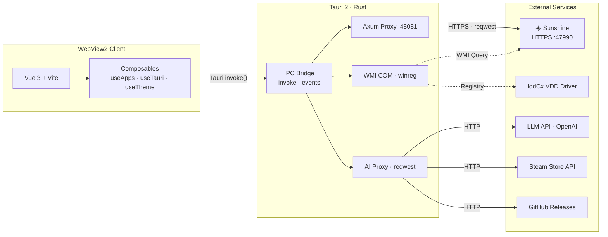

# Sunshine Control Panel (Tauri)

基于 Tauri 2 + Vue 3 的 Sunshine Foundation 大屏桌面管理器，提供游戏库管理、系统监控、AI 助手等功能。

## 架构



## 功能特性

### 核心能力

- 🔄 **更新管理** — 自动检查更新、下载进度、一键安装，支持 Beta/预发布版本切换
- ⚡ **运行模式切换** — 服务模式 ↔ 用户模式一键切换
- 🔌 **服务管理** — Sunshine 启停、重启、运行状态监控、配对设备管理
- 📊 **内存监控** — 进程内存/工作集实时趋势图、子进程列表、运行时间统计

### 游戏库

- 🎮 **应用管理** — 网格/列表视图、搜索过滤、收藏置顶、最近使用、排序
- 🖼️ **Steam 封面搜索** — 右键更新封面，Steam Store API 搜索候选，一键上传
- 🚀 **一键启动** — 右键启动游戏/应用，支持管理员权限、工作目录
- 🔧 **启动助手** — 为应用配置前置/后置脚本（虚拟显示器、分辨率切换等）
- 📚 **游戏库扫描** — 自动扫描 Steam/Epic 已安装游戏

### 串流与驱动

- 🎬 **串流配置** — 编码器选择 (H.264/H.265/AV1)、码率调节、HDR 自动切换
- 📺 **VDD 驱动管理** — 虚拟显示驱动安装/配置/EDID 管理
- 🖱️ **虚拟鼠标** — 驱动安装与状态管理
- 🌙 **Moonlight Web** — 浏览器串流服务管理

### 智能与工具

- 🤖 **米塔 AI** — 为 Sunshine 及客户端提供大模型能力，多模型配置、桌面宠物
- 🛠️ **工具箱** — 码率调节器、DPI 缩放、键盘快捷键指南、系统诊断
- 📋 **日志管理** — 实时日志查看、导出、过滤

### 桌面体验

- 🎨 **主题切换** — 亮色/暗色/自定义背景
- 🌍 **中英双语** — 即时切换
- 🪟 **多窗口** — 主窗口 + 浮动工具栏 + 日志控制台
- ☀️ **防休眠** — 串流期间保持屏幕/系统唤醒
- 🔑 **全局快捷键** — Ctrl+Shift+Alt+T 切换工具栏

## 前置要求

- Node.js 和 npm
- Rust 和 Cargo (用于 Tauri)
- Windows SDK (Windows)

## 开发

```bash
# 安装依赖
npm install

# 启动开发服务器（代理到 Sunshine 服务）
npm run dev

# 仅启动前端开发服务器
npm run dev:renderer
```

### WebUI 联调开发模式

当需要同时开发 WebUI 和 Tauri GUI 时，可以使用 `dev-webui` 模式让 Tauri 代理服务器转发请求到 WebUI 开发服务器：

```bash
# 终端 1：在项目根目录启动 WebUI 开发服务器（端口 3000）
cd ../../../..  # 回到 Sunshine 根目录
npm run dev-server

# 终端 2：在 sunshine-control-panel 目录启动 Tauri（代理到 WebUI 开发服务器）
npm run dev-webui
```

这种模式下：
- WebUI 开发服务器运行在 `https://localhost:3000`
- Tauri 代理服务器会将请求转发到 WebUI 开发服务器
- 支持 HMR（热模块替换），修改 WebUI 代码会实时生效
- API 请求仍会被 WebUI 开发服务器代理到 Sunshine 服务（`https://localhost:47990`）

## 构建

```bash
# 构建渲染进程
npm run build:renderer

# 构建完整应用
npm run build

# Windows 构建
npm run build:win
```

## 项目结构

```
src-tauri/           # Tauri 后端 (Rust)
  ├── src/
  │   ├── main.rs            # 主入口、命令注册
  │   ├── proxy_server.rs    # Axum 本地代理 (Sunshine/Steam API/CORS)
  │   ├── sunshine.rs        # Sunshine 进程管理、路径工具
  │   ├── system.rs          # 系统信息 (WMI 进程查询、内存统计)
  │   ├── fs_utils.rs        # 文件系统、游戏扫描、Steam 封面搜索/上传
  │   ├── commands.rs        # HTTP 客户端、应用启动
  │   ├── vdd.rs             # VDD 驱动管理
  │   └── windows.rs         # Windows 注册表/autostart
  ├── inject-script.js       # 注入到 Sunshine Web UI 的脚本
  └── Cargo.toml

src/renderer/        # 前端 (Vue 3)
  ├── desktop/              # Desktop UI (独立 SPA)
  │   ├── views/            # 页面视图 (Dashboard、Apps、Settings...)
  │   ├── components/       # 组件 (AppGrid、ContextMenu、CoverPicker...)
  │   ├── composables/      # 组合式函数 (useApps、useTauri...)
  │   └── i18n/             # 国际化 (zh、en)
  ├── components/           # 共享组件
  └── styles/               # Less 样式

vite.config.js       # Vite 构建配置
package.json         # NPM 依赖
```

## 技术栈

- **前端**: Vue 3 + Less + 自定义组件
- **后端**: Rust + Tauri 2
- **HTTP**: Axum (代理)、reqwest (HTTP 客户端)
- **系统**: WMI (进程查询)、Win32 API (内存统计)、Windows Registry
- **构建**: Vite

## 集成到 Sunshine

编译后的 GUI 会自动安装到 Sunshine 的 `assets/gui` 目录：

```
Sunshine/
  └── assets/
      └── gui/
          └── sunshine-gui.exe
```

## 注意事项

- Tauri GUI 是可选组件，不影响 Sunshine 核心功能
- 需要 Rust 工具链才能构建 Tauri 应用
- 首次构建会下载并编译 Rust 依赖，需要较长时间
