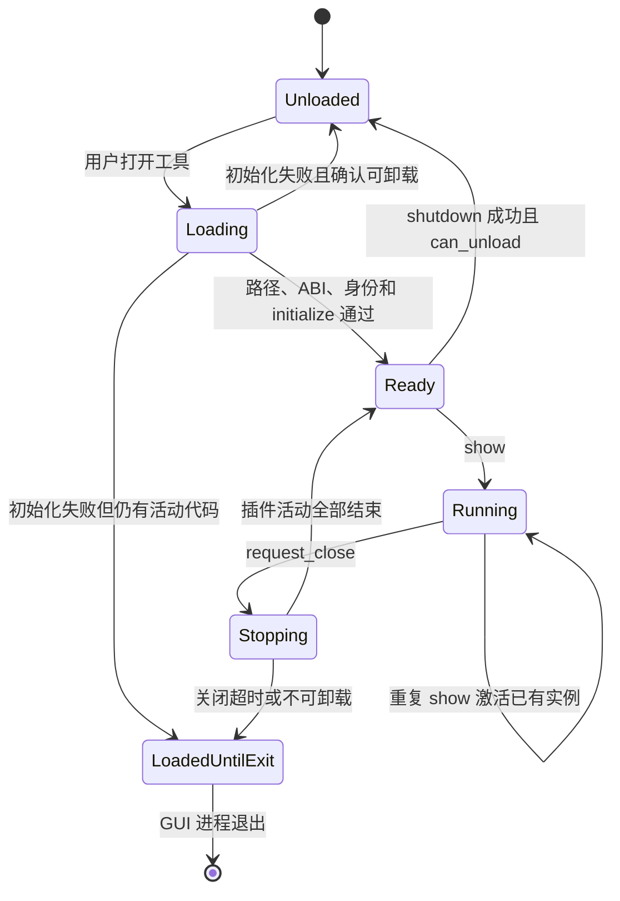

# GUI 原生工具插件协议

## 1. 适用范围

本文定义 Sunshine Control Panel 在 Windows 上加载同进程原生工具 DLL 的稳定合同。它只
描述通用身份、ABI、生命周期、安全和分发规则，不记录具体工具的功能设计或接入过程。

原生工具插件适用于必须直接访问 Windows 消息、设备接口或其他 native API，且不适合在
WebView 中实现的独立工具。普通设置页面和低频业务逻辑继续使用 Vue、Tauri 和 Rust。

`native_components` 注册表可以同时描述 GUI 插件和由 Sunshine Core 使用的组件；只有
`ComponentHost::Gui` 且声明单个固定 DLL 的条目可以进入本协议定义的插件加载器。
Core 组件不实现本 ABI，也不得由 GUI 通过 `LoadLibrary` 加载。

跨宿主的身份、文件角色、安装及运行边界遵守 [原生侧载组件接入合同](native_component_contract.md)。
本协议只定义 GUI 工具 DLL 的执行接口，不要求厂商运行库或 Core 内置适配代码实现该 ABI。

## 2. 身份与发现

- 组件身份、宿主、固定文件名和分发策略编译在 GUI 中。
- GUI 不扫描目录发现插件，不读取远程清单增加可执行插件。
- 前端只能提交注册表中的稳定工具 ID，不能提交 DLL 路径或命令行。
- 工具 ID 使用稳定的命名空间形式；DLL 使用固定文件名，发布后不因显示名称或页面位置改变。
- GUI 插件必须随 Panel 同一版本构建和分发，不允许用户导入或在线替换。

注册条目的通用形态如下：

```rust
ComponentDescriptor {
    id: "<namespace>.<tool>",
    category: <stable category>,
    host: ComponentHost::Gui,
    files: &["<fixed-plugin-name>.dll"],
    distribution: DistributionPolicy {
        bundled: true,
        download: false,
        local_import: false,
    },
    install_subdirectory: None,
}
```

## 3. C ABI

插件只导出以下入口：

```text
AlkaidLabNativeTool_GetApi(host_abi_version) -> *const NativeToolPluginV1
```

入口仅在支持请求的 ABI 主版本时返回静态、不可变的 `NativeToolPluginV1`；不支持时返回
空指针。ABI 表、字符串及函数目标必须在 DLL 的完整加载期内保持有效。

`NativeToolPluginV1` V1 字段：

- `struct_size`：结构体实际大小；扩展只能追加在尾部。
- `abi_version`：必须等于宿主请求的 ABI 主版本。
- `tool_id`：UTF-8、NUL 结尾，必须与编译期注册表完全一致。
- `plugin_version`：UTF-8、NUL 结尾，仅用于诊断和版本展示。
- `display_name`：UTF-16、NUL 结尾，仅用于本地展示。
- `initialize(host)`：验证并复制宿主服务。
- `show()`：创建工具或激活已有实例。
- `request_close()`：异步请求停止窗口、线程和回调。
- `shutdown(timeout_ms)`：在期限内完成停止和资源回收。
- `is_running()`：报告是否仍有插件代码可能被窗口、线程、计时器或回调进入。
- `can_unload()`：确认可以安全调用 `FreeLibrary`。

`NativeToolHostV1` 由宿主在 `initialize()` 调用期间借用。插件不得保存该结构体指针，必须
复制允许长期使用的回调、上下文值和图标句柄。默认大、小窗口图标由宿主持有，插件不得
销毁；自定义图标为 `0` 时回退宿主图标。

所有跨 ABI 的导出函数、窗口过程、线程入口和系统回调都必须收口 panic/异常，不能让它们
越过 DLL 边界。协议返回稳定的 `NativeToolResult`，详细原因只写入本地日志。

## 4. 生命周期



合同要求：

- `show()` 返回成功前必须先发布可观察的 running/starting 状态，避免宿主监视器误卸载。
- 重复 `show()` 不创建第二套窗口、线程或全局回调。
- `request_close()` 和 `shutdown()` 必须幂等。
- `initialize()` 返回失败时也必须清理已启动的活动；无法在期限内停止时，
  `can_unload()` 必须返回 false。
- 线程、计时器、窗口过程或宿主回调仍可能进入插件代码时，宿主不得调用 `FreeLibrary`。
- 关闭超时后保留模块到 GUI 进程退出，不通过强制卸载回收内存。
- GUI 退出时，宿主对所有已加载插件请求关闭；插件不应留下独立于 GUI 的后台进程。

## 5. 文件与权限边界

插件路径只能由 `current_exe().parent()` 与注册表固定文件名组合。加载前必须确认：

- 目标存在、非空且是普通文件。
- 文件不是符号链接或重解析到安装目录外的对象。
- 规范化后的父目录仍是 GUI 可执行文件目录。
- ABI 版本、结构大小、必需函数和工具 ID 全部匹配。

`LoadLibrary` 会在 ABI 校验前执行 DLL 初始化代码，因此 ABI、ID 和版本字段不是恶意 DLL
隔离机制。GUI 插件只接受由同一 Panel 安装包携带的文件；安装目录完整性依赖安装包、签名
（存在时）和 Windows ACL。需要加载用户提供文件、在线下载文件或处理不可信 native 代码
的功能不得使用同进程插件协议。

插件继承 `sunshine-gui.exe` 当前令牌。插件协议不提供权限降级或沙箱；必须以较低权限运行
的功能应放入受控独立进程。管理员模式下加载插件的风险需要由 GUI 整体权限模型处理，不能
通过 ABI 字段假装隔离。

原生工具命令只授权给 GUI 自带的本地页面，嵌入的 Sunshine WebUI 不得直接调用。
如果未来确需从 WebUI 打开工具，应由 Panel 父页面校验固定消息类型和工具 ID 后代为调用；
WebUI 不能取得插件路径、组件维护或任意本机文件操作能力。

## 6. 错误合同

宿主对前端只返回稳定错误码：

- `NATIVE_PLUGIN_UNKNOWN`
- `NATIVE_PLUGIN_NOT_FOUND`
- `NATIVE_PLUGIN_PATH_INVALID`
- `NATIVE_PLUGIN_LOAD_FAILED`
- `NATIVE_PLUGIN_ENTRY_MISSING`
- `NATIVE_PLUGIN_ABI_MISMATCH`
- `NATIVE_PLUGIN_ID_MISMATCH`
- `NATIVE_PLUGIN_INIT_FAILED`
- `NATIVE_PLUGIN_START_FAILED`

错误消息不得携带本机绝对路径、原始系统异常、命令行或插件内部指针。面向用户的文案由
Panel 本地化层根据稳定错误码生成。

## 7. 资源与本地化

宿主只提供协议中声明的回调和默认图标，不向插件暴露 Tauri 内部对象。新增宿主能力必须：

1. 追加到 ABI 结构尾部。
2. 增加 `struct_size` 能力检查。
3. 定义所有权、线程和失效时间。
4. 保持旧插件在缺少新字段时可拒绝或降级。

插件需要多语言时，使用插件自身的单一 JSON 资源。所有语言具有相同、非空且按字典序排列
的 key；只翻译标题、控件、提示和结论。协议字段、事件名、错误码、路径及持久化数据不翻译。

## 8. 构建与分发合同

插件 crate 必须使用：

```toml
[lib]
crate-type = ["cdylib"]
```

Panel Release ZIP 平铺存放 `sunshine-gui.exe`、全部内置插件，以及构建所需的可选运行库。
Sunshine 只能下载和安装同一个 Panel Release 产生的完整 ZIP，不能分别取得 EXE 与插件 DLL，
避免组合不同版本。完整安装与 GUI 组件安装使用同一份文件集合。

SignPath 流程存在时同时签名 GUI 和插件；没有签名的本地构建仍可用于开发，但签名状态不
改变 ABI 或生命周期规则。

发布顺序固定为：Panel 先发布可获取的完整 ZIP，Sunshine 再记录该 Panel commit/Release
并构建安装包。Sunshine 不得引用远端尚不可获取的子模块提交。

## 9. 一致性检查

- 注册表只允许固定 ID、固定文件名和固定宿主。
- Core 组件不能进入 GUI 插件加载器。
- 缺失、空文件、路径异常、入口缺失、ABI 或 ID 不匹配不会结束 GUI。
- 首次打开创建工具，重复打开只激活已有实例。
- 初始化失败、启动失败、正常关闭、关闭超时和 GUI 退出均遵守卸载条件。
- `shutdown()` 成功且 `can_unload()` 为 true 之前不调用 `FreeLibrary`。
- 插件不保留借用的宿主结构体指针，不销毁宿主图标。
- 前端只能使用稳定工具 ID 和错误码，不接触 DLL 路径。
- Panel Release ZIP、GUI 组件安装包和 Sunshine 安装包携带同版本 DLL。
- 新增 ABI 字段、命令或错误码时同步更新宿主、插件、权限和测试。
