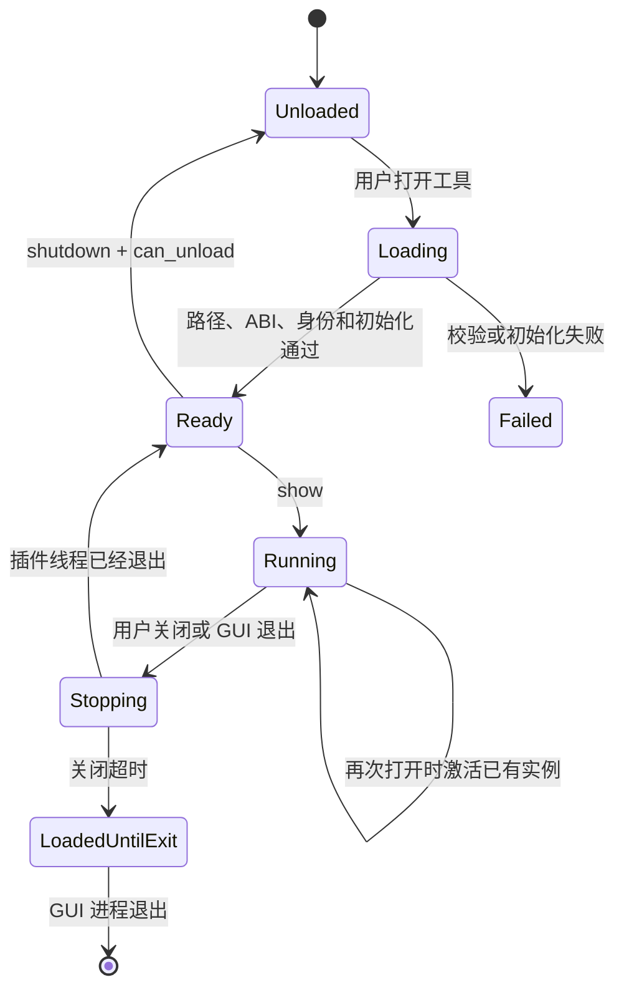

# GUI 原生工具插件开发指南

## 1. 适用范围

本文说明如何为 Sunshine Control Panel 开发随 GUI 安装、按需加载的 Windows 原生工具
插件。具体工具的业务行为不放在本文中；手写笔检测工具参见
[手写笔输入检测插件](stylus_input_diagnostics_plugin.md)。

原生工具适用于必须直接访问 Windows 消息、设备接口或其他 native API，且不适合放进
WebView 的功能。普通设置页面和低频业务逻辑仍应使用现有 Vue、Tauri 和 Rust 后端实现。

## 2. 架构约束

- `sunshine-gui.exe` 只包含通用插件管理器，不静态链接具体工具实现。
- 插件使用 Rust `cdylib`，以稳定 C ABI 与 GUI 通信，不暴露 Rust ABI。
- 插件 DLL 与 GUI 位于同一安装目录，随同一安装包和 Release ZIP 分发。
- 插件列表编译在 GUI 中，不扫描目录、不读取远程清单。
- 前端只能传注册表中的工具 ID，不能传 DLL 路径或命令行。
- 插件只在用户打开工具时加载；安全关闭后才能释放 DLL。
- 插件与 GUI 位于同一进程。访问冲突或堆损坏等 native 故障仍可能结束 GUI；需要进程
  隔离的工具不应使用本插件模型。


## 3. 目录和注册位置

新增插件通常涉及以下位置：

```text
native-plugins/
├─ Cargo.toml                 # 插件 workspace
├─ plugin-api/                # 宿主与插件共享的 C ABI 定义
└─ <tool>/                    # 新插件 crate
src-tauri/src/native_tools.rs # 编译期注册表和生命周期管理器
src/renderer/                 # 工具入口、状态和本地化文案
scripts/build-native-plugins.ps1
scripts/package-gui-bundle.ps1
```

注册项使用固定 ID、文件名和 ABI：

```rust
PluginDescriptor {
    id: "alkaidlab.stylus",
    file_name: "alkaidlab-plugin-stylus.dll",
    expected_abi: 1,
}
```

命名应满足：

- 工具 ID 使用稳定的 `alkaidlab.<tool>` 形式。
- DLL 使用 `alkaidlab-plugin-<tool>.dll` 形式。
- 已发布的 ID 不因显示名称或页面位置变化而修改。

## 4. ABI 实现

插件只导出以下入口：

```text
AlkaidLabNativeTool_GetApi(host_abi_version) -> PluginApiV1
```

`PluginApiV1` 包含：

- `struct_size`：支持在结构体尾部兼容扩展。
- `abi_version`：主版本不兼容时拒绝加载。
- `tool_id`：必须与编译期注册表完全一致。
- `plugin_version`：用于日志和状态展示。
- `initialize(host)`：保存受控宿主回调。
- `show()`：创建或激活工具界面。
- `request_close()`：异步请求关闭。
- `shutdown(timeout_ms)`：等待窗口、线程和回调退出。
- `is_running()`：报告插件窗口、线程或回调是否仍在运行，供宿主关闭监控判断是否可以进入
  `shutdown()` 和卸载流程。
- `can_unload()`：确认宿主可以执行 `FreeLibrary`。

宿主目前提供分级日志和默认大、小窗口图标。需要新增能力时应在 ABI 结构尾部扩展，并
同时检查 `struct_size`，不能向插件暴露 Tauri 内部对象。

插件导出函数必须使用 `catch_unwind` 收口 Rust panic。窗口过程、线程入口和其他由操作
系统反向调用的边界同样不能让 panic 穿过 ABI。

## 5. 生命周期



不得在线程、计时器、窗口过程或宿主回调仍可能进入插件代码时调用 `FreeLibrary`。关闭
超时时保留模块到 GUI 退出，不能为了释放内存强制卸载。

工具应自行保证重复 `show()` 只激活已有实例。GUI 退出时，管理器按注册表逆序请求所有
已加载插件关闭。

## 6. 文件加载和安全边界

安装布局如下：

```text
assets/gui/
├─ sunshine-gui.exe
├─ alkaidlab-plugin-<tool>.dll
└─ WebView2Loader.dll（可选）
```

插件路径由 `current_exe().parent()` 与注册表中的固定文件名组合。加载前必须确认：

- 目标是普通文件且非空。
- 规范化路径仍位于 GUI 安装目录中。
- 不接受目录、符号链接、重解析到目录外的文件或前端提供的路径。
- 插件返回的工具 ID 和 ABI 与注册表一致。

安装目录完整性依赖安装包和 Windows ACL。工具 ID、版本号和 ABI 只用于兼容性检查，
不是密码学签名，也不能证明 DLL 未被篡改。

稳定错误码包括：

- `NATIVE_PLUGIN_NOT_FOUND`
- `NATIVE_PLUGIN_PATH_INVALID`
- `NATIVE_PLUGIN_ABI_MISMATCH`
- `NATIVE_PLUGIN_ID_MISMATCH`
- `NATIVE_PLUGIN_INIT_FAILED`
- `NATIVE_PLUGIN_START_FAILED`

错误细节写入本地日志；前端显示稳定、可理解的错误，不暴露本机路径。

## 7. 开发步骤

1. 在 `native-plugins` workspace 中新增 `cdylib` crate，并依赖 `plugin-api`。
2. 实现唯一的 C ABI 入口和完整生命周期函数。
3. 在 `native_tools.rs` 中增加固定注册项，不增加目录扫描或任意路径加载。
4. 在 GUI 工具注册表、入口组件和中英文资源中增加显示项。
5. 将 DLL 加入本地构建、Panel Release ZIP、GUI 组件安装包和 Sunshine Inno 安装链路。
6. 添加 ABI、初始化、重复打开、关闭和异常输入测试。
7. 更新对应工具的独立设计文档，不把业务细节继续堆入本指南。

原生工具需要多语言时，应把稳定 key 放入插件自身的单一 JSON 资源，并在测试中检查各
语言 key 集合一致、值非空且源文件按字典序排列。只翻译面向用户的标题、控件、提示和
结论；协议字段、事件名、错误码、路径及持久化数据不得翻译。

GUI 宿主通过 `NativeToolHostV1` 提供从自身可执行文件提取的默认大、小窗口 `HICON`，
句柄由宿主持有，插件不得销毁。插件有自定义图标时将自定义句柄传给
`resolve_window_icon()`；没有自定义图标时传入 `0`，统一回退 Sunshine 默认图标。若宿主
和插件均未提供图标，返回 `0` 并交给 Windows 使用默认窗口图标，不得因此阻止工具启动。

## 8. 构建和发布

插件 crate 必须声明：

```toml
[lib]
crate-type = ["cdylib"]
```

本地构建和测试：

```powershell
cargo test --manifest-path native-plugins/Cargo.toml --release
./scripts/build-native-plugins.ps1 -Configuration Release
```

Panel CI 在构建 GUI 前测试并构建所有内置插件，再生成固定名称的
`sunshine-gui-windows-x64.zip`。ZIP 中平铺存放 `sunshine-gui.exe`、所有内置插件和可选
的 `WebView2Loader.dll`。

Sunshine 构建只从同一个 Panel Release 下载该 ZIP，解压并校验必需文件后放入
`assets/gui`。不得分别下载 EXE 和 DLL，以免组合不同版本。SignPath 流程存在时同时签名
GUI 和插件；未使用 SignPath 不影响加载。


发布顺序固定为：先发布 Panel ZIP，再构建引用该 Release 的 Sunshine 安装包。

## 9. 通用验证清单

- 插件缺失、损坏、路径异常和 ABI 不匹配不会导致 GUI 退出。
- 第一次打开创建工具，重复打开只激活已有实例。
- 关闭后 `shutdown` 成功并允许卸载；超时路径不会强制卸载。
- GUI 退出时不残留插件线程、窗口、计时器或宿主回调。
- 插件异常不会继续调用已经失效的宿主对象。
- Panel Release ZIP、GUI 组件安装包和 Sunshine 安装包均携带同版本 DLL。
- 新增前端 API 或错误码时同步检查全部调用方和中英文文案。
