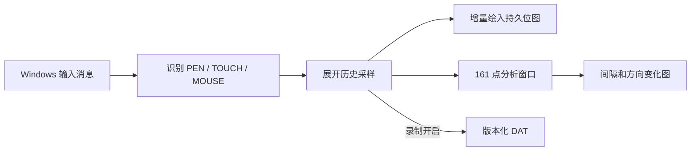

# 手写笔输入检测插件

## 1. 目标

手写笔输入检测插件用于观察 Windows 实际交付给应用的手写笔、触摸和兼容鼠标事件，
帮助区分设备采样、客户端传输、Sunshine 注入和 Windows 消息提升产生的现象。

WebView Pointer Events 无法完整保留 `WM_POINTER` 历史采样、压力、倾角和兼容鼠标关联
信息，因此本工具使用 Rust `cdylib` 和独立 Win32 原生窗口。插件接入和发布规范参见
[GUI 原生工具插件开发指南](native_tool_plugin_development.md)。
界面迁移和兼容要求参见
[手写笔输入检测插件界面兼容设计](stylus_input_diagnostics_ui_design.md)。

本工具是输入诊断工具，不是绘画软件：

- 不修改 Sunshine 的输入路由。
- 不对坐标进行平滑、插值或重新采样。
- 不提供 Photoshop 式图层编辑、无限撤销或笔刷语义。
- 不在窗口外采集输入，也不全局监听键盘或鼠标。
- 只有用户点击“开始检测”后才采集画布输入；停止后冻结结果，避免后续输入污染结论。

## 2. 输入来源

插件处理以下 Windows 消息和接口：

- `WM_POINTER*` 和 `GetPointerPenInfoHistory`：原始 `PT_PEN` 及合并历史采样。
- `WM_POINTER*` 和 `GetPointerTouchInfoHistory`：原始 `PT_TOUCH` 及多接触点历史。
- `WM_MOUSE*` 和 `GetMessageExtraInfo`：鼠标消息及由手写笔、触摸提升的兼容鼠标消息。
- `WM_POINTERCAPTURECHANGED`、离开画布和抬起：结束当前笔划，避免跨边界连线。

只有白色画布内的输入进入统计和录制。窗口按钮、标题栏拖动以及画布外输入不计入结果。



## 3. 事件显示和兼容鼠标

- 蓝色压力线：`PT_PEN`。
- 绿色线：原始 `PT_TOUCH`。
- 红色线：普通鼠标以及系统提升的兼容鼠标消息。

工具通过 `GetMessageExtraInfo` 区分手写笔提升和触摸提升的鼠标消息，并分别计数。用户可
开启“过滤兼容鼠标消息”观察只消费 `PT_PEN` 时的轨迹差异。过滤后的笔兼容鼠标不进入
普通鼠标计数、红色轨迹、实时卡或最近事件，只在诊断详情中保留过滤计数。该开关不修改
Windows、Sunshine 或绘画软件的输入行为。

## 4. 画布和实时分析

画布采用两层模型：

1. 持久位图底层保存已经显示的笔迹。
2. 增量点队列只保存上一次成功绘制之后的新点。

增量点写入底图后立即释放，运行时间增加不会让实时绘图队列持续增长。普通窗口缩小时
保留已有底图尺寸，窗口扩展时复制到底图的新尺寸；跨显示器 DPI 变化时同步缩放底图、
增量点和各输入源的最后位置。清空画布、开始新录制或导入新数据时才重置底图。

实时分析与绘图队列分离：

- 只保留最近 161 个手写笔点，对应最近 160 个采样间隔。
- 当前笔划总点数由独立计数器维护，不需要保存整条笔划。
- 新笔划开始时重置分析窗口和计数器。
- 分析计算间隔 Median、P95、P99、Max、标准差，统计 `>16.7 ms`、`>20 ms`、
  `>33.3 ms` 的次数，并计算相邻方向变化的 Median/P95。
- 分析在 16 ms UI 刷新节奏内完成；161 点计算量很小，不引入后台线程和同步锁。

持久底图只保证视觉轨迹保留。需要复查全部原始点时必须使用 DAT 录制。

## 5. 录制和导入

录制文件采用版本化文本 DAT：

```text
SUNSHINE_STYLUS_DAT	1
# columns=P timestamp_us event_type x y pressure rotation tilt_x tilt_y
P <timestamp_us> <event_type> <x> <y> <pressure> <rotation> <tilt_x> <tilt_y>
```

主要规则：

- 坐标和压力归一化到 `0..1`。
- 未提供的旋转和倾角分量使用协议保留值，不根据压力伪造接触面积。
- Tilt X/Y 分别保存，导入后可以恢复非对称倾角。格式尚未发布，v1 直接采用双倾角字段，
  不兼容开发阶段产生的单倾角文件。
- 离开画布、捕获丢失或异常结束时写入 `CANCEL`，防止导入后连接两段独立笔划。
- 每 256 个样本或笔划抬起时刷新缓冲区，减少逐点磁盘同步。
- 开始检测时自动创建 DAT 并增量写入；录制内存只保留计数和最后一个样本，不保存完整
  副本。
- 导入用于复查已有 DAT；工具不会修改导入数据，因此不提供重复导出。
- 单个文件上限为 64 MiB，最多读取或录制 200000 个样本。
- 达到样本上限时只写一次 `# truncated=true`，不继续扩张内存和文件。
- 导入时校验文件类型、事件类型、有限数值、坐标范围和单调时间戳。

录制文件和运行日志位于：

```text
%TEMP%\Sunshine\stylus-input-probe\recordings
```

运行日志记录启动、录制、导入、异常和周期摘要，不逐包写日志。

## 6. 窗口和生命周期

- 工具使用独立 Win32 窗口线程和消息循环，不创建额外 WebView。
- 重复打开只激活已有窗口，不创建第二个实例。
- 十字光标只在画布区域显示。
- 使用 Per-Monitor DPI Awareness V2，控件和轨迹随目标显示器 DPI 调整。
- 右上角语言选择默认使用“自动（系统语言）”，并按 Windows UI locale 匹配 Sunshine 的语言白名单：`bg`、`cs`、`de`、`en`、`en_GB`、`en_US`、`es`、`fr`、`it`、`ja`、`pt`、`ru`、`sv`、`tr`、`zh`、`zh_TW`。
- 下拉框允许在当前窗口中手动选择上述任一语言；无法匹配的系统 locale 回退英文。
- 窗口标题、控件、引导、诊断结论和指标标签在切换语言后立即刷新。
- 控件宽度根据当前字体和翻译文本测量；设置最大宽度，并在横向空间不足时整组换行，避免长译文覆盖相邻控件。
- 手写笔插件未声明自定义图标，因此使用插件宿主从 GUI 可执行文件提取的 Sunshine 默认窗口图标；插件不重复嵌入同一份 ICO。
- DAT 字段、Windows 事件名、协议标识、数值和本机路径不参与翻译，保证导入、日志解析和问题对比稳定。
- 窗口状态使用短时互斥保护，窗口过程重入时不阻塞消息线程。
- 关闭时停止计时器、完成录制缓冲写入并退出窗口线程；线程退出前不得卸载 DLL。

## 7. 性能边界

已经实施的限制：

- 绘图使用持久离屏位图，普通重绘不遍历全部历史点。
- 增量点成功写入位图后立即释放。
- 分析窗口固定为 161 点。
- Windows 单次合并历史最多读取 512 个点。
- 同一条 Windows 历史消息只获取一次窗口状态和画布范围，再按时间顺序批量处理。
- 16 ms 重绘计时器只在存在待绘制内容时启动，完成一次重绘后停止，不产生空闲唤醒。
- GDI 画笔按 DPI 缓存，只在 DPI 改变时重建。
- UI 使用按窗口尺寸复用的整窗双缓冲，轨迹层与文字、采样图完全分离。
- Segoe UI 字体按当前显示器 DPI 创建，控件和自绘文字使用同一字体。
- DAT 和日志使用缓冲写入，不逐个事件刷新。

后续只有在性能数据证明必要时才考虑：

- 对超大 DAT 导入进行分帧栅格化，避免单次窗口绘制时间过长。
- 记录脏矩形并只复制变化区域；在现有全窗口 `BitBlt` 成为实测瓶颈前不增加复杂度。

## 8. 已知边界

- DLL 与 GUI 同进程，native 访问冲突仍可能结束 GUI。
- 位图底层中的旧笔迹不能单独撤销或恢复为可编辑点；原始数据由 DAT 保留。
- 多次跨 DPI 缩放会对已经压平的位图进行重采样，不等同于矢量画布。
- 插件语言选择只作用于当前 GUI 进程；重新启动后默认恢复为“自动（系统语言）”。
- 插件使用独立的单文件 `i18n.json`，支持 Sunshine 当前全部可配置语言，不与 WebView 的 Vue-i18n 状态耦合。
- 真实手写笔、触摸历史、兼容鼠标和跨显示器 DPI 行为仍需要人工设备测试。

## 9. 验证清单

- 手写笔、触摸和普通鼠标只在画布内产生轨迹和统计。
- 蓝、绿、红三类事件与 Windows 输入类型一致。
- 过滤开关只隐藏手写笔提升的兼容鼠标，不影响原始 `PT_PEN`。
- 长时间绘制不会持续增加增量点队列，旧笔迹不会从底图消失。
- 分析图最多显示 160 个间隔，同时保留当前笔划完整点数。
- 画布离开、捕获丢失和抬起不会连接到下一段笔划。
- DAT 自动录制、导入、截断标记和非法文件拒绝符合格式约束。
- 窗口跨不同 DPI 显示器后保持清晰，控件和轨迹位置正确。
- 关闭工具和退出 GUI 后不残留窗口线程、计时器或文件句柄。
