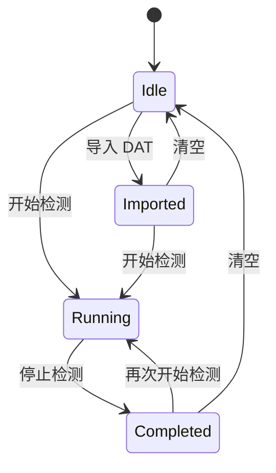

# 手写笔输入检测插件最终界面设计

## 1. 定位

手写笔输入检测插件不是事件查看器，也不是绘画软件。它的目标是引导用户完成一次有边界
的输入测试，并把 Windows 实际交付的手写笔、触摸和兼容鼠标事件转成可理解的结论。

原版 `tools/stylus_input_probe.cpp` 提供了完整的原始数据，但信息平铺较多。插件版在保留
原始诊断能力的同时，将主流程调整为：

```text
开始检测 → 连续书写 3～5 秒 → 停止检测 → 查看结论和关键指标
```

开始检测时自动创建并增量写入 DAT。用户不需要再执行“导出”；“导入数据”继续用于加载
历史 DAT，复查旧版和新版客户端的轨迹与采样差异。

## 2. 已确认的界面问题

- 系统标题栏曾缺少标题，主界面又重复绘制一行工具名。
- UI 文字、采样图和轨迹曾写入同一持久位图，调整窗口尺寸后产生残影。
- 普通鼠标悬停曾被错误绘制为红色轨迹。
- 所有按钮权重相同，开始测试的主流程不突出。
- 原始计数器和技术报告平铺显示，用户需要自行解释数据。
- 画布没有空状态，也没有直观的实时 Pointer、压力和采样信息。
- 运行日志路径属于开发细节，不应出现在主界面。

## 3. 设计原则

- 系统标题栏显示“AlkaidLab - 手写笔输入检测”，内容区不重复标题。
- “开始检测/停止检测”是唯一主操作，开始时清空旧状态并自动录制 DAT。
- 输入只在检测进行中采集；停止后冻结结果，避免后续鼠标移动污染结论。
- 主界面显示结论和可解释指标，原始统计默认折叠。
- 不把正常的 Windows 兼容鼠标机制简单判为异常。
- 不显示无法可靠取得的设备名称、VID/PID，也不伪造丢包率。
- 日志继续写入本地，但界面只保留“打开日志”入口，不显示路径。

## 4. 最终布局

布局尺寸按 96 DPI 基准缩放：

```text
┌────────────────────────────────────────────────────────────────┐
│ 请点击“开始检测”，然后在画布内连续书写 3～5 秒。               │
│ [过滤笔兼容鼠标] [开始检测] [打开录制目录]  [清空][复制][导入][日志] │
│ ┌────────────────────── 检测状态 ───────────────────────────┐ │
│ │ ● 等待开始 / 正在检测 / 检测完成 / 已导入数据             │ │
│ └────────────────────────────────────────────────────────────┘ │
│ ┌──────────────────── 白色检测画布 ─────────────────────────┐ │
│ │         请在这里用手写笔连续书写 3～5 秒                  │ │
│ │                                                            │ │
│ │                                  Pointer  PEN              │ │
│ │                                  Pressure 62%              │ │
│ │                                  采样率   126 Hz           │ │
│ │                                  最近间隔 4.1 ms           │ │
│ └────────────────────────────────────────────────────────────┘ │
│ 检测结果：正常 / 需要关注 / 未检测到手写笔                     │
│ PT_PEN 586  PT_TOUCH 0  MOUSE 421  PEN→MOUSE 0                │
│ 采样率 126 Hz  Median 7.8 ms  P95 9.1 ms  Max 16.3 ms          │
│ [ ] 显示诊断详情                                               │
└────────────────────────────────────────────────────────────────┘
```

默认窗口为 `980×820` 的 DPI 等比尺寸，新增高度优先用于画布。窗口较窄时，右侧辅助操作
移到第二行，状态卡和画布同步下移，控件不得重叠。

## 5. 操作与状态模型

状态分为四类：



- `Idle`：不采集画布输入，显示操作提示。
- `Running`：采集、绘制、分析并增量写入 DAT。
- `Completed`：冻结轨迹和统计，生成结论。
- `Imported`：显示 DAT 中的数据和基于文件时间戳计算的指标。

“打开录制目录”放在开始检测旁边。“导出数据”移除，因为录制已经生成 DAT，导入数据也
不会被工具修改。

## 6. 空状态和实时信息卡

画布没有输入时显示淡色提示：

```text
请在这里用手写笔连续书写 3～5 秒
落笔 → 连续移动 → 抬笔 → 再次落笔
```

首次接触后隐藏提示。画布右上角实时卡只显示能够从事件直接证明的信息：

- Pointer 类型：PEN、TOUCH 或 MOUSE。
- Pointer ID。
- 压力、Tilt X/Y、Rotation；设备未报告时明确显示“未上报”。
- 最近 160 个间隔计算出的采样率和最近间隔。

实时卡不显示推测的设备型号、VID/PID、网络延迟或丢包率。

## 7. 自动结论规则

结论必须基于可观测事实，分为：正常、需要关注、未检测到手写笔、数据不足。

完成或导入后的判定按以下顺序执行，命中后不再继续，保证结论互斥：

1. Windows 指针读取错误不为 0：`需要关注`。
2. `PT_PEN` 接触事件为 0，且存在鼠标接触：`未检测到手写笔`。
3. `PT_PEN` 接触事件为 0，且没有鼠标接触：`数据不足`。
4. 没有正数采样间隔，例如单点 DAT 或全部时间戳相同：`数据不足`。
5. Down、Move、Up 不完整，或采样间隔超过阈值：`需要关注`。
6. 其余情况：`正常`。

### 7.1 正常

- 收到 `PT_PEN`。
- 至少包含 Down、Move 和 Up。
- Windows API 读取错误为 0。
- P95 间隔不超过 20 ms，且超过 33.3 ms 的间隔为 0。

### 7.2 需要关注

任一条件满足：

- 有 `PT_PEN`，但 Down、Move、Up 不完整。
- 读取错误不为 0。
- P95 大于 20 ms，或存在超过 33.3 ms 的长间隔。
- 设备未报告压力时只提示“未上报”，不直接判定设备故障。

### 7.3 未检测到手写笔

- `PT_PEN` 为 0，且存在鼠标接触事件。
- 提示“当前输入只被识别为鼠标消息，请检查客户端、驱动或 Windows Ink 设置”。

### 7.4 兼容鼠标

收到 `PEN→MOUSE` 不自动判为异常。Windows 为手写笔生成兼容鼠标消息属于正常机制；
只有应用同时消费两条轨迹时才可能抖动。结论中说明已检测到兼容消息，并建议使用过滤开关
进行 A/B 对比。

过滤开启后，笔兼容鼠标消息不进入 `MOUSE` 计数、红色轨迹、实时卡、最近事件和普通
结论，只在折叠详情中记录“已过滤兼容鼠标”计数。检测进行中不能修改过滤条件；修改条件
会清空当前结果，下一次检测使用新条件。

## 8. 指标定义

主界面显示：

- 采样率：`1000 / interval_median_ms`，使用中位间隔避免少量长间隔过度影响。
- Median、P95、P99、Max。
- `>16.7 ms`、`>20 ms`、`>33.3 ms` 的间隔数。
- `PT_PEN`、`PT_TOUCH`、`MOUSE` 和 `PEN→MOUSE` 计数。

诊断详情展开后显示：

- Down、Move、Up、Hover、Cancel、读取错误。
- 压力、Tilt、Rotation 范围。
- 方向变化 Median/P95。
- 最近事件和 DAT 是否截断。

“丢点次数”不显示。Windows Pointer API 没有提供可用于严格判断丢包的连续序列号，长
间隔只能描述为交付间隔异常，不能等同于网络丢包。

DAT 导入拒绝无样本文件，允许相邻样本使用相同 `timestamp_us`。分析器忽略零间隔；如果
单点 DAT 或全部时间戳相同而没有正数间隔，采样率和间隔指标显示 `-`，结论为“数据不足”。
超过 1 秒的正数间隔仍计入 Max 和三个长间隔阈值，不能因为显示尺度而丢弃最严重的停顿。

## 9. 绘制和性能

- 持久轨迹层只保存画布和轨迹，不包含 UI。
- 可复用整窗帧缓存每帧重新绘制当前 UI，再合成轨迹层，避免调整尺寸残影和闪烁。
- 增量点写入轨迹层后立即释放。
- 实时分析只保留 161 点，对应最近 160 个间隔。
- 16 ms 重绘计时器按需启动，空闲时停止。
- 同一条 Windows 历史消息一次获取窗口状态和画布范围，最多批量处理 512 个点。
- GDI 画笔和 Segoe UI 字体按 DPI 缓存。

## 10. 实施清单

- [x] T01 轨迹层与 UI 分离，修复窗口尺寸变化残影。
- [x] T02 鼠标悬停只统计，左键接触期间才绘制。
- [x] T03 持久轨迹、161 点分析、按需重绘和批量历史处理。
- [x] T04 系统标题栏、DPI 字体、状态卡和默认画布高度。
- [x] T05 移除内容区重复标题、日志路径和复制路径入口。
- [x] T06 将“打开录制目录”移动到主操作区。
- [x] T07 保留导入，移除冗余导出及其专用保存代码。
- [x] T08 建立 Idle、Running、Completed、Imported 状态边界。
- [x] T09 将录制按钮改为开始/停止检测，并停止保存完整内存副本。
- [x] T10 增加画布空状态和实时 Pointer 信息卡。
- [x] T11 增加自动结论和关键指标卡。
- [x] T12 增加 P99、标准差和三个长间隔阈值统计。
- [x] T13 增加默认折叠的诊断详情。
- [x] T14 更新测试并完成 Release 构建。
- [ ] T15 人工验证不同 DPI、窗口尺寸和三类输入。
- [x] T16 过滤后的笔兼容鼠标不进入普通鼠标显示，并在切换条件时清空旧结果。
- [x] T17 增加右上角语言选择，默认按 Windows UI locale 匹配 Sunshine 全部可配置语言，并即时刷新标题和界面文案。
- [x] T18 使用单一 JSON 管理翻译，校验核心界面键完整、值非空且每种语言按字典序排列；诊断数据保持不翻译。
- [x] T19 补齐等待状态、采样图和指标的多语言文本，并按当前字体动态测量控件宽度；空间不足时换行而非覆盖。
- [x] T20 使用插件宿主提供的 Sunshine 默认大、小窗口图标，避免每个插件重复嵌入相同 ICO。

## 11. 验收场景

1. 未开始检测时移动或点击鼠标，画布和统计不变化。
2. 开始检测后，鼠标悬停只计数不绘线；按下拖动才显示红线。
3. 手写笔完成 Down、Move、Up 后停止，显示正常或基于指标的明确原因。
4. 只有鼠标接触而没有 `PT_PEN` 时，结论提示未检测到手写笔。
5. 收到兼容鼠标消息时说明其含义，不直接判为异常。
6. 导入 DAT 后显示轨迹和文件指标，不提供重复导出。
7. 连续调整窗口宽高不出现旧文字、重复采样图或控件重叠。
8. 窗口跨不同 DPI 显示器后，字体、控件、轨迹和信息卡位置正确。
9. 首次打开默认选择“自动（系统语言）”；切换任一 Sunshine 支持的语言后无需重启即可刷新窗口标题、控件和诊断文案。
